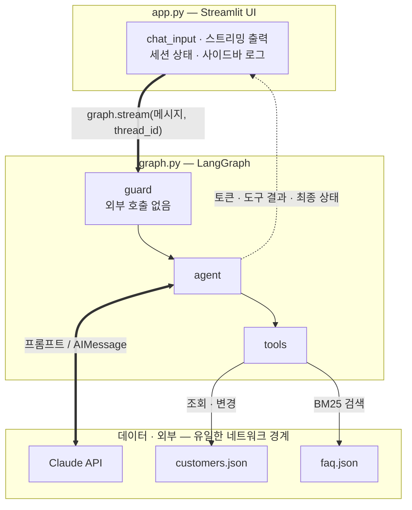
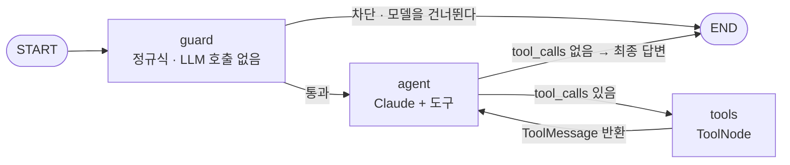

# 고객센터 에이전트 해부도

> `ai_agent/` — 금융권 고객센터 AI 상담 에이전트의 코드 리딩 가이드

사용자가 채팅창에 한 문장을 입력한 뒤 답변이 화면에 찍히기까지, 그 문장이 어떤 모듈을
어떤 순서로 통과하는지 추적한 문서입니다. 파일 지도부터 메시지 배열의 변화까지, 처음 보는
사람이 코드를 열지 않고도 흐름을 따라갈 수 있도록 정리했습니다.

| 소스 모듈 | 소스 라인 | 테스트 | 업무 도구 | 그래프 노드 |
| --- | --- | --- | --- | --- |
| 8 | 1,020 | 46 (352줄) | 7 | 3 |

**목차**

1. [세 계층과 그 사이의 I/O](#1-세-계층과-그-사이의-io)
2. [파일 지도](#2-파일-지도)
3. [그래프는 한 턴을 어떻게 라우팅하는가](#3-그래프는-한-턴을-어떻게-라우팅하는가)
4. [한 턴, 여섯 단계](#4-한-턴-여섯-단계)
5. [메시지 배열은 이렇게 자란다](#5-메시지-배열은-이렇게-자란다)
6. [나머지 두 갈래](#6-나머지-두-갈래)
7. [도구는 왜 클로저로 만드는가](#7-도구는-왜-클로저로-만드는가)
8. [API 없이 그래프 전체를 검증하는 법](#8-api-없이-그래프-전체를-검증하는-법)
9. [바꿔 끼울 지점](#9-바꿔-끼울-지점)

---

## 1. 세 계층과 그 사이의 I/O

코드는 세 층으로 나뉩니다. **UI 층**은 화면과 세션만 다루고, **그래프 층**은 한 턴의 제어
흐름을 소유하며, **데이터·외부 층**은 실제 I/O가 일어나는 곳입니다. 아래 그림에서 중요한 건
화살표의 방향입니다 — 외부 호출은 `agent` 와 `tools` 두 노드에서만 발생하고, `guard` 는
어디로도 나가지 않습니다.



외부 I/O가 일어나는 지점은 두 곳뿐입니다. `guard` 가 정규식만으로 동작하기 때문에 차단
판정은 네트워크·비용·지연 없이 끝납니다.

---

## 2. 파일 지도

각 모듈은 하나의 관심사만 담당하고, 의존은 항상 위에서 아래로 흐릅니다. `graph.py` 가
나머지를 조립하는 유일한 지점입니다.

| 경로 | 줄 | 역할 | 핵심 심볼 |
| --- | ---: | --- | --- |
| `app.py` | 187 | Streamlit UI. 세션·스트리밍·로그 표시 | `stream_turn()`, `reset_session()` |
| `graph.py` | 159 | 노드·분기·상태를 조립해 그래프 컴파일 | `build_graph()`, `AgentState`, `last_answer()` |
| `guardrails.py` | 204 | PII 마스킹 · 입력 차단 · 출력 검사 | `screen_input()`, `mask_pii()`, `apply_output_guard()` |
| `tools/banking.py` | 241 | 업무 도구 7종과 감사 로그 | `CustomerToolkit.as_tools()`, `_resolve_account()` |
| `retriever.py` | 112 | 한국어 BM25 FAQ 검색 | `BM25Retriever`, `tokenize()`, `get_retriever()` |
| `prompts.py` | 64 | 시스템 프롬프트 템플릿 | `build_system_prompt()` |
| `config.py` | 44 | 환경변수 기반 설정 싱글턴 | `Settings`, `get_settings()` |
| `data/*.json` | — | 목 고객 2명, FAQ 12건 | — |

의존 방향: `app.py` → `graph.py` → {`guardrails`, `prompts`, `tools`} → `retriever` → `data`.
역방향 import 는 없습니다.

---

## 3. 그래프는 한 턴을 어떻게 라우팅하는가

그래프는 노드 3개와 조건부 간선 2개로 이루어집니다. 분기를 결정하는 함수는 각각
`route_after_guard` 와 `route_after_agent` 이고, 둘 다 **상태의 마지막 메시지 타입만 보고**
판단합니다 — 별도의 플래그를 두지 않아 상태와 라우팅이 어긋날 여지가 없습니다.



차단 경로가 이 설계의 핵심입니다 — 차단은 `agent` 를 통과하지 않으므로 모델이 설득당할
기회 자체가 없습니다. 상태는 `InMemorySaver` 에 `thread_id` 단위로 저장돼 다음 턴에 그대로
이어집니다.

**분기 함수 전문**

```python
def route_after_guard(state: AgentState) -> str:
    # guard가 AIMessage(고정 응답)를 붙였다면 = 차단된 것
    return END if isinstance(state["messages"][-1], AIMessage) else "agent"

def route_after_agent(state: AgentState) -> str:
    last = state["messages"][-1]
    return "tools" if getattr(last, "tool_calls", None) else END
```

---

## 4. 한 턴, 여섯 단계

사용자가 *"제 110-234-567890 계좌 최근 거래 알려주세요"* 를 입력했을 때 실제로 벌어지는
일입니다. 단계 번호는 실행 순서 그 자체입니다.

### 1단계 — `app.py`: 입력을 받고 화면용으로 먼저 마스킹

`st.chat_input` 이 원문을 받습니다. 화면 이력에 남길 문장은 `mask_pii()` 를 한 번 통과시켜
계좌번호를 가린 뒤 저장합니다. 그래프에는 원문을 넘깁니다 — 마스킹은 그래프 안에서 다시,
그리고 정본으로 일어납니다.

### 2단계 — `graph.stream()`: 두 가지 스트림 모드로 실행

`stream_mode=["messages", "updates"]` 로 호출합니다. `messages` 는 토큰 단위 출력을,
`updates` 는 노드별 상태 변화를 내보내므로, 한 번의 실행으로 **타이핑 효과와 도구 호출 로그를
동시에** 얻습니다.

### 3단계 — `guard`: 마스킹하고, 통과시킬지 정한다

`screen_input()` 이 원문 기준으로 차단 룰을 먼저 검사한 뒤 마스킹합니다. 순서가 반대면
`"비밀번호는 ****"` 가 되어 룰이 걸리지 않습니다. 마스킹된 문장은 **원본과 같은 `id`** 로
상태에 다시 넣습니다.

### 4단계 — `agent`: 시스템 프롬프트를 얹어 Claude 호출

`[SystemMessage(고정), *state["messages"]]` 형태로 프롬프트를 구성합니다. 시스템 프롬프트에
현재 시각 같은 가변값이 없어 캐시 프리픽스가 유지됩니다. 모델이 `get_transactions` 호출을
결정하면 `tool_calls` 가 붙은 `AIMessage` 가 돌아옵니다.

### 5단계 — `tools`: 실행하고 소유권을 재검증

`ToolNode` 가 도구를 실행합니다. 모델이 넘긴 계좌번호는 `_resolve_account()` 가 **세션 고객의
계좌 목록과 대조**합니다. 마스킹된 번호도 뒤 4자리로 매칭되고, 남의 계좌면 거절 문자열이
돌아갑니다. 결과는 `ToolMessage` 로 상태에 추가되고 흐름은 `agent` 로 복귀합니다.

### 6단계 — `app.py`: 스트리밍 텍스트가 아니라 최종 상태를 정본으로

루프가 끝나면 `graph.get_state(config).values` 를 읽어 `last_answer()` 로 답변을 꺼냅니다.
스트리밍 중 쌓인 버퍼를 그대로 쓰지 않는 이유는, **출력 가드레일이 붙인 고지 문구가 최종
상태에만 반영**되기 때문입니다. 같은 상태에서 `guard_events` 를 꺼내 사이드바에 표시합니다.

---

## 5. 메시지 배열은 이렇게 자란다

`AgentState` 는 필드가 둘뿐입니다. `messages` 는 `add_messages` 리듀서를, `guard_events` 는
`operator.add` 를 씁니다. 위 4장 시나리오에서 배열이 변하는 모습입니다.

| # | 노드 | `messages` | `guard_events` |
| ---: | --- | --- | --- |
| 0 | 입력 | `[Human("…110-234-567890 계좌…")]` | `[]` |
| 1 | `guard` | `[Human("…110-***-**7890 계좌…")]` — *같은 id라 덮어쓰기* | `["마스킹:계좌번호"]` |
| 2 | `agent` | \+ `AI(tool_calls=[get_transactions])` | — |
| 3 | `tools` | \+ `Tool("110-234-567890 … 최근 거래 3건")` | — |
| 4 | `agent` | \+ `AI("최근 3건은 …입니다")` → `END` | — |

1단계의 덮어쓰기가 핵심입니다. 배열에 두 벌이 쌓이는 게 아니라 원문이 *교체*되므로, 이후
어떤 턴의 프롬프트에도 원문이 다시 실리지 않습니다.

> **`add_messages` 의 id 규칙**
> 리듀서는 기본적으로 메시지를 뒤에 붙이지만, 같은 `id` 를 가진 메시지가 오면 그 자리를
> *교체*합니다. `guard` 가 마스킹에, `agent` 가 출력 가드레일에 같은 기법을 씁니다 —
> 상태를 직접 수정하지 않고도 내용을 바꾸는 LangGraph 의 관용적인 방법입니다.

---

## 6. 나머지 두 갈래

정상 경로 외에 그래프가 갈 수 있는 길은 둘뿐입니다.

### 차단 — 모델을 아예 부르지 않는 경로

`"어떤 주식 살까요?"` 같은 입력은 `guard` 에서 `BLOCK_RULES` 에 걸립니다. 고정 응답이
`AIMessage` 로 붙고 `route_after_guard` 가 `END` 를 돌려주므로 `agent` 는 실행되지 않습니다.
테스트는 **응답이 없는 가짜 모델**을 주입해 이를 증명합니다 — 모델이 한 번이라도 불리면
`AssertionError` 가 납니다.

### 상한 — 도구 루프가 길어질 때

`_tool_rounds()` 가 `tool_calls` 를 가진 `AIMessage` 수를 세고, `max_tool_iterations`(기본 8)에
도달하면 `agent` 가 **도구를 뺀 모델**로 전환하고 마무리 안내를 붙입니다. 단순히 `END` 로
끊지 않는 이유는, 그러면 `tool_calls` 에 짝이 없는 `AIMessage` 가 이력에 남아 다음 턴 요청이
깨지기 때문입니다.

```python
rounds = _tool_rounds(state["messages"])
if rounds >= settings.max_tool_iterations:
    prompt.append(SystemMessage(content=TOOL_LIMIT_MESSAGE))
    response = model.invoke(prompt)          # 도구 없는 모델 → 반드시 텍스트로 끝난다
else:
    response = model_with_tools.invoke(prompt)
```

---

## 7. 도구는 왜 클로저로 만드는가

`CustomerToolkit.as_tools()` 는 도구 함수를 *메서드로 정의해 두고 반환*하지 않고, 호출
시점에 **함수를 새로 만들어** 반환합니다. 그 함수들은 바깥 스코프의 `customer` 를
캡처합니다.

```python
class CustomerToolkit:
    def as_tools(self) -> list[BaseTool]:
        customer = self.customer          # 인증된 세션의 고객 — 여기서 고정된다

        @tool
        def get_accounts() -> str:
            """인증된 고객 본인의 보유 계좌와 잔액, 이체한도를 조회한다."""
            ...                            # customer 를 클로저로 참조
```

결과적으로 `get_accounts` 의 스키마에는 **인자가 하나도 없습니다.** 모델이 "누구의 계좌를
볼지"를 표현할 방법이 도구 인터페이스에 존재하지 않으므로, 프롬프트 인젝션으로 타인 계좌를
조회하는 경로가 원천적으로 막힙니다.

인자를 받아야 하는 `get_transactions` 는 두 번째 방어선을 씁니다 — 모델이 넘긴 계좌번호를
`_resolve_account()` 가 세션 고객의 계좌 목록과 대조하고, 일치하지 않으면 데이터 대신 거절
문자열을 돌려줍니다.

| 도구 | 인자 | 상태 변경 | 방어 방식 |
| --- | --- | :---: | --- |
| `search_faq` | `query` | | 고객 데이터 접근 없음 |
| `get_accounts` | 없음 | | 클로저 고정 |
| `get_cards` | 없음 | | 클로저 고정 |
| `get_transactions` | `account_no`, `limit` | | 소유권 재검증 + limit 클램프 |
| `report_card_lost` | `card_last4` | ✅ | 보유 카드 대조 · 멱등 처리 |
| `request_limit_increase` | `daily_limit`, `reason` | ✅ | 현재 한도와 비교 · 금액대별 분기 |
| `escalate_to_human` | `topic`, `summary` | ✅ | 티켓 발급 · 감사 로그 |

상태를 바꾸는 도구는 모두 `toolkit.actions` 에 `ActionRecord` 를 남기고, 사이드바가 이 목록을
그대로 보여줍니다.

---

## 8. API 없이 그래프 전체를 검증하는 법

`build_graph()` 는 `settings`, `toolkit`, `llm`, `checkpointer` 를 모두 주입받습니다. 테스트는
`llm` 자리에 `ScriptedModel` 을 넣습니다 — 준비된 `AIMessage` 를 순서대로 뱉고, 준비된
개수보다 많이 불리면 실패하는 40줄짜리 가짜 모델입니다.

덕분에 46개 테스트가 **네트워크 없이 1.2초**에 끝나고, "차단 시 모델이 호출되지 않는다" 같은
*부재*에 대한 주장도 검증할 수 있습니다.

| 파일 | 개수 | 검증 대상 |
| --- | ---: | --- |
| `test_guardrails.py` | 18 | 마스킹 정확도, 패턴 우선순위(전화번호↔계좌번호), 차단 카테고리, 출력 고지 |
| `test_tools.py` | 12 | 타인 계좌 거절, 마스킹 번호 조회, 멱등 분실신고, 한도 분기 |
| `test_retriever.py` | 9 | bigram 토큰화, 질의별 최상위 문서 |
| `test_graph.py` | 7 | 차단 시 모델 미호출, PII 미유입, 도구 왕복, 루프 상한, 스레드 격리 |

> **가장 설명하기 좋은 테스트**
> `test_pii_is_masked_before_reaching_the_model` 은 가짜 모델이 받은 프롬프트를 직접
> 열어보고 주민번호 문자열이 없음을 확인합니다. "마스킹했다"는 주장을 구현이 아니라
> *모델이 실제로 본 입력*으로 검증합니다.

---

## 9. 바꿔 끼울 지점

데모용 선택을 운영용으로 교체할 때 손대야 할 곳은 명확히 분리돼 있습니다.

| 현재 | 운영 전환 | 영향 범위 |
| --- | --- | --- |
| JSON 목 데이터 | 코어뱅킹 API 어댑터 | `tools/banking.py` 의 조회 함수 본문만 |
| `InMemorySaver` | `langgraph-checkpoint-postgres` | `build_graph(checkpointer=…)` 인자 한 줄 |
| 자체 BM25 | pgvector · OpenSearch | `BM25Retriever.search()` 시그니처 유지한 채 내부만 |
| 정규식 가드레일 | 룰 + 분류 모델 2단 구성 | `guardrails.screen_input()` 뒤에 단계 추가 |
| Streamlit | FastAPI + 프론트엔드 | `graph.stream()` 호출부만 이식 — 그래프는 UI 를 모름 |

### 아직 없는 것

- 답변 품질 회귀 테스트(LLM-as-judge)와 도구 선택 정확도 지표
- 실제 Claude 호출 기반의 종단 검증 — 프롬프트 튜닝은 API 키를 넣고 시나리오를 돌리며 진행해야 합니다
- 동시 세션 부하 테스트, 토큰 사용량·비용 계측

---

실행 방법과 스택 선택 이유는 [`ai_agent/README.md`](../ai_agent/README.md) 를 참고하세요.
